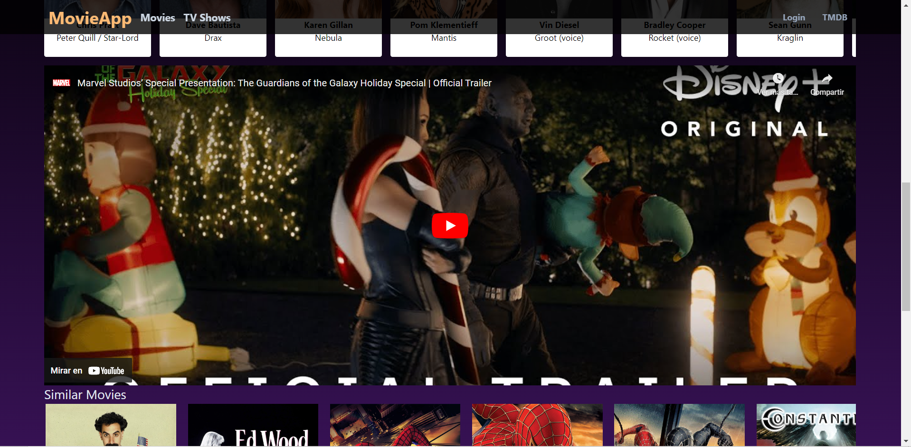

# MOVIES APP

Movies website to find information about Movies, TV Shows and more. This is another project looking for improving my code skills. Leave a like and enjoy the App!!

* This project was built using React Js with Tailwind Js.

# Screenshots

**Version v1.8.0**

**Version v1.5.0**

**Version v1.4.0**

**Version v1.2.0**

**Version v1.1.0**

**Version v1.0**
### `Home`

# Versions

**v1.8.0**
* Tv shows detail bug fixed.
* Responsive desing bugs fixed.

**v1.7.0**
* Tv shows detail beta.
* Responsive desing.

**v1.6.0**
* Search input bugs fixed.

**v1.5.0**
* Search input fixed.
* Movies tariler videos bug fixed.
* Null & undefined images fixed.

**v1.4.0**
* Clean code.
* Responsive design fixed bugs.
* Daily trending section added.
* Movies trailer added.
* Nabvar scroll fixed.

**v1.3.0**
* Clean code.
* Responsive design.

**v1.2.0**
* Movie detail added.
* Movie credits added.
* New concept movie slider.

**v1.1.0**
* New upcoming movies carousel.
* New search component design.
* Bugs fixed.
* firebase-config.js implemented.

**v1.0**
* Fetching most popular movies.
* Configuraiton layout (Header, Main, Footer).
* Beta deployment.

# Libraries, Frameworks, Technologies

1. Html
2. Css
3. JavaScript
4. [React Js](https://es.reactjs.org/)
5. [npm js](https://www.npmjs.com/)
6. [Tailwind Js](https://tailwindcss.com/)

# Credits 
Thanks to [TMDB](https://www.themoviedb.org/) for creating an awesome API for developers and companies uses. To [React Icons](https://react-icons.github.io/react-icons/search?q=search) for provide icons for developers. I appreciate your team's hard work in providing the data needed to take my coding skills to the next level.

# Copyright Note
This is a personal project, is non-commercial. This, is just for improve my web development skills using React Js, Tailwind Js, and fetching API's. Feel free to enjoying my personal websites and look for your favorite movie.